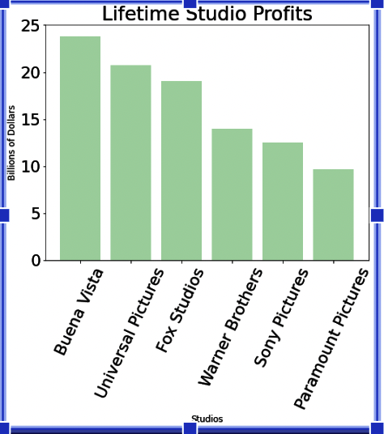
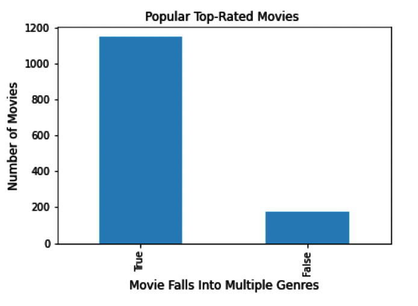
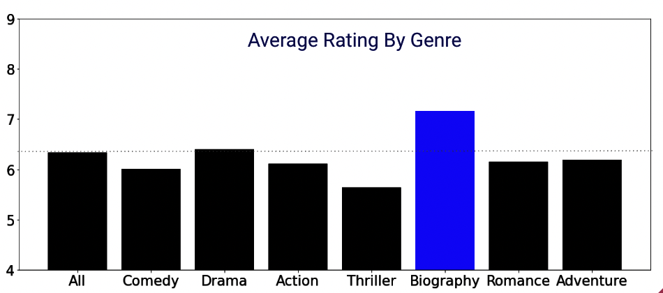

# Microsoft Movie Studio

## Overview
Flatiron School Data Science Phase 1 project.

## Business Problem
Microsoft sees all the big companies creating original video content and they want to get in on the fun. They have decided to create a new movie studio, but they don’t know anything about creating movies. You are charged with exploring what types of films are currently doing the best at the box office. You must then translate those findings into actionable insights that the head of Microsoft's new movie studio can use to help decide what type of films to create.

## Data Used
data from the following sources can be found in the 'zippedData' folder

    * [IMDB](https://www.imdb.com/) - im.db.zip
    * [Box Office Mojo](https://www.boxofficemojo.com/) - bom.movie_gross.csv.gz
    * [The Numbers](https://www.the-numbers.com/) - tn.movie_budgets.csv.gz

## Movie Data ERD
"

## Deliverables
* [Non-Technical Presentation]()
* [GitHub Repository](https://github.com/ceflynn/dsc-phase-1-project-v2-4)
* [Jupyter Notebook](https://github.com/ceflynn/dsc-phase-1-project-v2-4/blob/master/student.ipynb)

## Action Steps
**Recommendation 1** - Compete with Big Studios

Using data from BokOfficeMovie.com and the-numbers.com, I was able to create a data set that produced the the profits for all studios.  The process included data cleaning and calucluating total profit.  Data Visualization provided below.

**Recommendation 2** - Create Multi-Genre Movies 

Data from IMDB.com was used to create a dataframe that would be used to comparem multi and single Genre movies.
The data had to be cleaned to separate and categorize each movie and genre.  Data visualization can be found below.
  

**Recommendation 3** - Focus on Biographies

The same data was used from Recommendation 2 to get the average rating for each genre.  Please, see the data visualization below for details.

## Repository
* images
    * awesome.gif
    * microsoftlogo.png
    * movie_data_erd.jpeg
* pdf
    * microsoft-pres.pdf
* zippedData
    * bom.movie_gross.csv.gz
    * im.db.zip
    * rt.movie_info.tsv.gz
    * rt.reviews.tsv.gz
    * tmdb.movies.csv.gz
    * tn.movie_budgets.csv.gz
* student.ipynb
* CONTRIBUTING.md
* Instructions.md
* LICENSE.md
* README.md
 